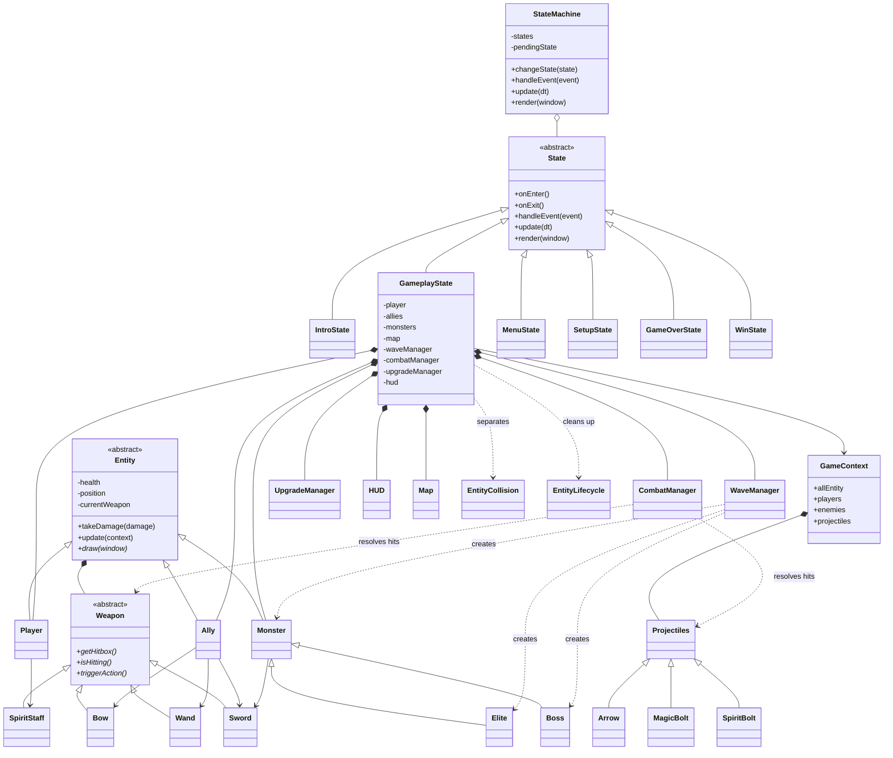
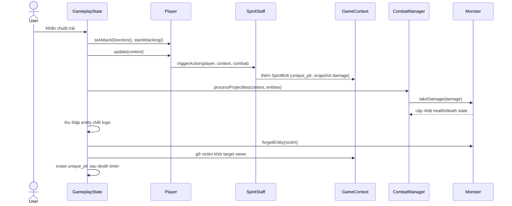

# Kiến trúc Eternal Siege

## Sơ đồ lớp

`GameplayState` là chủ sở hữu duy nhất của player, ally và monster.
`GameContext` chỉ giữ các con trỏ quan sát trong một frame, đồng thời sở hữu
projectile. Cấu trúc này tránh `delete` thủ công và tránh quyền sở hữu mơ hồ.

## Sơ đồ trình tự: người chơi bắn quái

## Áp dụng OOP

- **Đóng gói:** trạng thái máu, cooldown, vũ khí và dữ liệu wave được giữ trong
  lớp tương ứng, truy cập qua phương thức công khai.
- **Kế thừa:** các state kế thừa `State`; nhân vật kế thừa `Entity`; `Elite`
  và `Boss` kế thừa `Monster`; `Arrow`, `MagicBolt`, `SpiritBolt` kế thừa `Projectiles`; vũ khí kế thừa
  `Weapon`.
- **Đa hình:** `update`, `draw`, `triggerAction`, `isHitting` được gọi qua lớp
  cơ sở nhưng thực thi theo đúng lớp con.
- **Trừu tượng hóa:** `State`, `Entity` và `Weapon` định nghĩa hợp đồng chung
  bằng các hàm thuần ảo.

## Luồng gameplay

1. `Game` chuyển event cho `StateMachine`.
2. `GameplayState` dựng các view không sở hữu trong `GameContext`.
3. `WaveManager` có thể trả về một Monster mới cho owner container.
4. Player, Ally và Monster cập nhật bằng cùng `deltaTime`.
5. `EntityCollision` tách các entity sống; `CombatManager` xử lý vũ khí và đạn.
6. `EntityLifecycle` xóa target/cache trước khi owner erase entity đã hết
   death timer.
7. `RadiantPulse`, Effects, Boss Beam/Enrage và HUD chỉ cập nhật khi gameplay
   thực sự chạy; pause đóng băng timer mà không reset.
8. `GameplayTransitionGate` bảo vệ reward, intermission và Victory khỏi phát
   transition lặp; gameplay sau đó kiểm tra Game Over hoặc Win.
