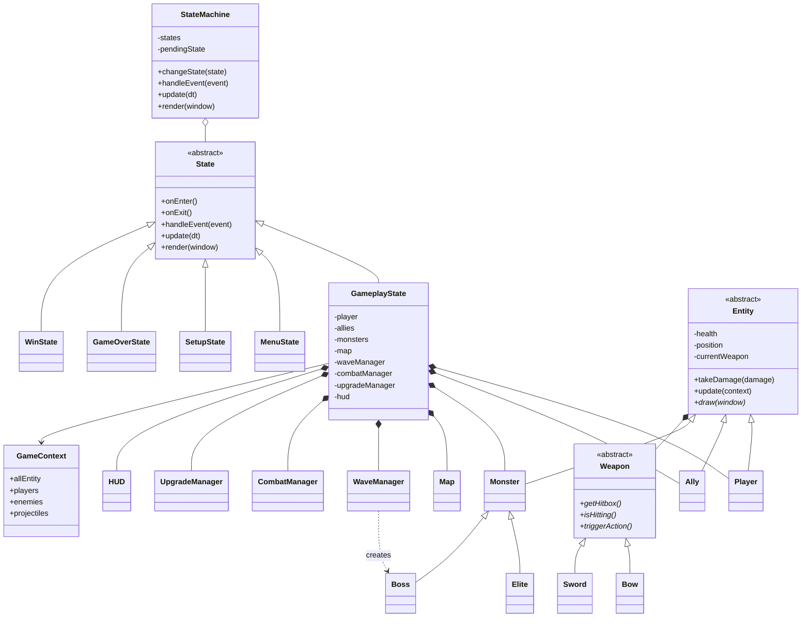
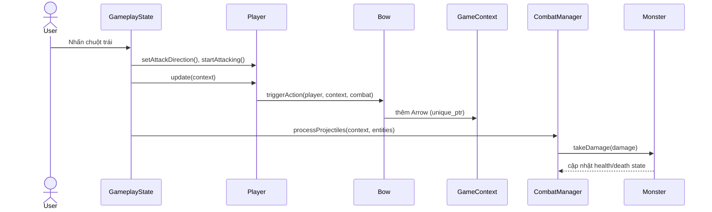

# Kiến trúc Eternal Siege

## Sơ đồ lớp

`GameplayState` là chủ sở hữu duy nhất của player, ally và monster.
`GameContext` chỉ giữ các con trỏ quan sát trong một frame, đồng thời sở hữu
projectile. Cấu trúc này tránh `delete` thủ công và tránh quyền sở hữu mơ hồ.

## Sơ đồ trình tự: người chơi bắn quái

## Áp dụng OOP

- **Đóng gói:** trạng thái máu, cooldown, vũ khí và dữ liệu wave được giữ trong
  lớp tương ứng, truy cập qua phương thức công khai.
- **Kế thừa:** các state kế thừa `State`; nhân vật kế thừa `Entity`; boss kế
  thừa `Monster`; vũ khí kế thừa `Weapon`.
- **Đa hình:** `update`, `draw`, `triggerAction`, `isHitting` được gọi qua lớp
  cơ sở nhưng thực thi theo đúng lớp con.
- **Trừu tượng hóa:** `State`, `Entity` và `Weapon` định nghĩa hợp đồng chung
  bằng các hàm thuần ảo.
